 

  

&nbsp;

&nbsp;

&nbsp;

 

  

<table>
<tr>
<td valign="top" width="56%">

<h2>🏢 &nbsp;Who We Are</h2>

<strong>tuppleX</strong> is a team of experienced engineers, designers, and product thinkers dedicated to building exceptional digital products. With experience delivering projects for clients across <strong>Europe</strong> and other international markets, we combine technical excellence with a strong focus on business outcomes.

We believe great software comes from close collaboration, thoughtful craftsmanship, and a relentless commitment to quality — principles that guide every project we take on.

<blockquote>
<em>Partners with founders and product teams to design, build, and scale software that actually holds up — senior engineers, zero handoffs, production-ready from day one.</em>
</blockquote>

</td>
<td valign="middle" align="center" width="44%">

 

 

</td>
</tr>
</table>

 

  

<h2>🚀 &nbsp;What We Build</h2>

<table>
<tr>
<td valign="top" width="25%">
<strong>💻 Core Engineering</strong>  
Custom Software Development 
Web Application Development 
Desktop Application Development 
Legacy Software Modernization 
Technical Consulting
</td>
<td valign="top" width="25%">
<strong>📱 Mobile &amp; Design</strong>  
iOS App Development 
Android App Development 
React Native Development 
Flutter Development 
UI/UX Design
</td>
<td valign="top" width="25%">
<strong>🏗 Enterprise Systems</strong>  
ERP Development 
CRM Systems 
E-Commerce Development 
SaaS Product Engineering 
Staff Augmentation
</td>
<td valign="top" width="25%">
<strong>☁️ Infrastructure &amp; Growth</strong>  
Cloud Infrastructure &amp; Migration 
DevOps &amp; CI/CD Automation 
Software QA &amp; Testing 
Cybersecurity &amp; Pen Testing 
AI &amp; ML Integration 
Search Engine Optimization
</td>
</tr>
</table>

 

  

<h2>🛠 &nbsp;Our Technology Stack</h2>

<strong>Frontend &amp; Web</strong>

  

  

<strong>Mobile</strong>

  

  

<strong>Backend &amp; Cloud</strong>

  

 

  

<h2>🌐 &nbsp;Industries We Serve</h2>

<table>
<tr>
<td valign="top" width="33%">
<strong>💳 FinTech &amp; Banking</strong> 
<em>Regulated. Fast. Trusted.</em>  
PCI-DSS &nbsp;·&nbsp; Open Banking &nbsp;·&nbsp; Real-time Payments &nbsp;·&nbsp; Fraud Detection
</td>
<td valign="top" width="33%">
<strong>🏥 Healthcare &amp; MedTech</strong> 
<em>Where precision saves lives.</em>  
HIPAA &nbsp;·&nbsp; HL7/FHIR &nbsp;·&nbsp; Medical Devices &nbsp;·&nbsp; Telehealth
</td>
<td valign="top" width="33%">
<strong>🛒 E-Commerce &amp; Retail</strong> 
<em>Every millisecond is revenue.</em>  
Headless Commerce &nbsp;·&nbsp; Personalisation &nbsp;·&nbsp; Inventory Systems &nbsp;·&nbsp; PWA
</td>
</tr>
<tr>
<td valign="top" width="33%">
<strong>🏟 Events, Sports &amp; Entertainment</strong> 
<em>Experiences that bring people together.</em>  
Event Management &nbsp;·&nbsp; Ticketing &nbsp;·&nbsp; Venue Ops &nbsp;·&nbsp; Booking Systems
</td>
<td valign="top" width="33%">
<strong>☁️ SaaS &amp; Cloud</strong> 
<em>Ship faster. Scale smarter.</em>  
Multi-tenancy &nbsp;·&nbsp; Usage Billing &nbsp;·&nbsp; Developer APIs &nbsp;·&nbsp; SOC 2
</td>
<td valign="top" width="33%">
<strong>🏭 Manufacturing &amp; IoT</strong> 
<em>The physical meets the digital.</em>  
MQTT/OPC-UA &nbsp;·&nbsp; Edge Computing &nbsp;·&nbsp; Digital Twin &nbsp;·&nbsp; Predictive Ops
</td>
</tr>
<tr>
<td valign="top" colspan="3">
<strong>🎓 EdTech &amp; Learning</strong> &nbsp;·&nbsp; <em>Learning that actually sticks.</em>  
LMS/LTI &nbsp;·&nbsp; Adaptive Learning &nbsp;·&nbsp; xAPI/SCORM &nbsp;·&nbsp; Gamification
</td>
</tr>
</table>

 

  

<h2>🤖 &nbsp;AI-Accelerated Engineering</h2>

 

We've built AI into every layer of our engineering process — from planning to QA. We're not building in the dinosaur age anymore — we evolve with the tech, move **10× faster**, solve smarter, and keep your feedback loop razor-sharp.

 

| &nbsp; | What AI Powers               | How It Helps                                       |
| :----: | ---------------------------- | -------------------------------------------------- |
|   🗺   | **Planning & Architecture**  | Rapid prototyping, smarter system design decisions |
|   🧠   | **Code Generation & Review** | Faster feature delivery, significantly fewer bugs  |
|   🧪   | **QA & Testing Automation**  | Test generation at scale, comprehensive coverage   |
|   📊   | **Analytics & Insights**     | Smarter dashboards, predictive recommendations     |
|   🔍   | **Standards Enforcement**    | Consistent code quality across the entire codebase |

 

  

<h2>📬 &nbsp;Let's Build Together</h2>

<h3>Ready to ship something exceptional?</h3>

<em>Tell us about your project. We respond within one business day.</em>

  

&nbsp;&nbsp;

  

|     |                                                                            |
| :-: | -------------------------------------------------------------------------- |
| 📧  | [info@tupplex.com](mailto:info@tupplex.com)                                |
| 📞  | [+880 1854 288385](tel:+8801854288385)                                     |
| 📍  | House: 262, Road: 5, Block: D, Eastern Housing, Pallabi, Dhaka, Bangladesh |

  

---

We support Palestine &nbsp;&nbsp;&nbsp;|&nbsp;&nbsp; © 2026 tuppleX Technologies, Inc. All rights reserved.

  

